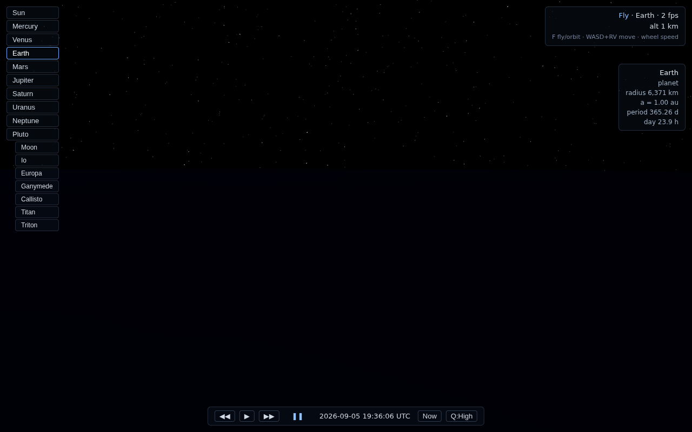
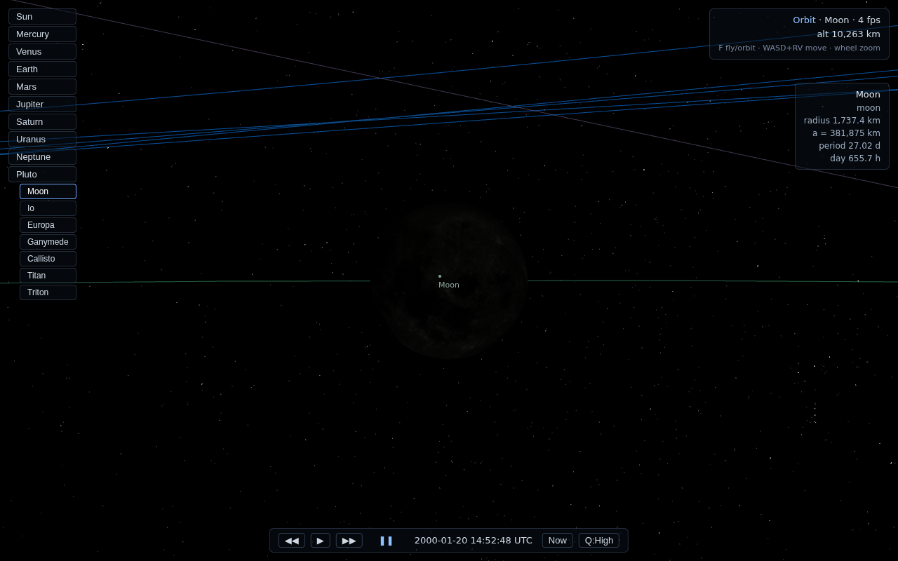

# Space Engine (web)

A SpaceEngine-style solar system simulator that runs in the browser:
the real Solar System with Keplerian orbits and seamless travel from
interplanetary space down to standing on procedurally detailed planetary
surfaces — no loading screens.

| | |
|---|---|
|  |  |
|  |  |
|  |  |

## Features

- **Real Solar System** — 8 planets, Pluto, the Moon, the Galilean moons,
  Titan and Triton. Planets follow the JPL approximate planetary elements
  (J2000 + centennial rates); moons use osculating elements pulled from the
  JPL Horizons API at J2000, so lunar phases and moon positions are real.
  Time warp from real time to ±10,000,000×.
- **Seamless scale** — camera-relative rendering with f64 positions on the
  CPU (the render world is origin-rebased to the focused body), reversed
  logarithmic depth, dynamic near plane. Fly from the Sun to Pluto and land
  on the Moon with zero jitter.
- **Landable planets** — cube-sphere quadtree LOD terrain: real albedo
  textures (NASA / Solar System Scope) plus a deterministic simplex-fBm
  heightfield with a meter-scale detail spectrum.
  The camera is clamped a few meters above the real ground. Chunk meshes are
  built either in a Web Worker pool or by a WebGPU compute shader — a startup
  probe times both and picks the winner (`?gpugen` / `?cpugen` to force one).
- **Atmospheres** — raymarched single-scattering (Rayleigh + Mie) for
  Earth, Mars, Venus and Titan, written in TSL so it compiles to both
  WebGPU and WebGL2. Blue sky and sunsets from the surface, glowing limb
  from orbit.
- **Real night sky** — the Yale Bright Star Catalog (9110 stars) placed by
  RA/Dec, sized by magnitude and tinted from B-V. Stars fade out inside a
  sunlit atmosphere, so daylight hides them and the night side keeps them.
- **Eclipses** — analytic solar-disc occlusion darkens the Moon during a
  lunar eclipse and dims the ground under a solar one. Saturn's rings cast a
  shadow on the planet and the planet casts one back across the rings.
- **Extras** — Earth's clouds and night-side city lights, HDR pipeline with
  ACES tone mapping and bloom, orbit lines, body labels and info panel.

## Running

```bash
npm install
npm run dev        # http://localhost:5173
npm test           # Kepler solver + terrain continuity unit tests
npm run build      # type-check + production build
```

WebGPU is used when available (Chrome/Edge, Safari 26+, Firefox 141+),
with an automatic WebGL2 fallback. Append `?webgl` to force the fallback.

## Controls

| Input | Action |
|---|---|
| click body / label | focus & fly to it |
| drag | orbit the focused body (orbit mode) / look around (fly mode) |
| wheel | zoom (orbit) / adjust speed (fly) |
| `F` | toggle orbit ↔ fly mode |
| `W A S D` + `R`/`V` | move in fly mode (speed scales with altitude) |
| `Q` / `E` | roll |
| `◀◀ ▶▶` | time warp, `Now` — jump to the current date |

## Architecture

```
src/
  core/        f64 math (Vec3d), constants, sim clock (Julian Date + warp)
  ephemeris/   Kepler solver, JPL element sets, body hierarchy
  data/        solar-system.json — orbital elements, radii, terrain and
               atmosphere parameters for every body
  render/      WebGPURenderer wrapper, HDR + ACES + bloom
  scene/       per-body views (impostor sphere ↔ terrain), origin rebasing,
               orbit lines, labels, rings, sun glow, starfield, eclipses,
               ring shadows
  terrain/     cube-sphere quadtree, worker pool, WGSL compute generator,
               shared heightfield
  atmosphere/  TSL single-scattering shader
  camera/      orbit/fly rig with f64 offsets and terrain clamp
  ui/          HUD: body list, time bar, status and info panels
```

Key invariants:

1. All world positions are f64 kilometers on the CPU (JS numbers). The GPU
   only ever sees coordinates relative to the focused body, so f32 stays
   precise where the camera is.
2. The terrain height function is **one global function per planet** — the
   octave cap does not depend on LOD level — so chunk borders match exactly
   across levels (verified by unit tests) and the camera clamp agrees with
   the rendered geometry.
3. Noise inputs are rounded to f32 even on the CPU, so the worker path, the
   WGSL kernel and the camera's terrain clamp all sample the same lattice.

## Verification

Unit tests (`npm test`) cover the Kepler solver against real positions and
phases, chunk-border continuity across LOD levels and cube faces, and the
eclipse geometry.

`scripts/verify-*.mjs` are Playwright checks run during development (headless
Chromium):

| script | what it checks |
|---|---|
| `verify-m2` | fly-through Sun → Moon → Pluto |
| `verify-jitter` | consecutive frames byte-identical 5 km above the Moon |
| `verify-m3` | LOD descent screenshots |
| `verify-m4` | landing: park, pitch to the horizon, fly against the clamp |
| `verify-stars` | star field in space, at night, and hidden by daylight |
| `verify-shadows` | lunar eclipse darkening, Saturn ring/planet shadows |
| `verify-gpu-terrain` | WGSL output vs the CPU reference, plus timings |

## Honest limitations / roadmap

- Orbits are unperturbed two-body Kepler propagation from J2000 elements, so
  events drift with time: the January 2000 total lunar eclipse lands within
  ~14 hours of the real one, and the error grows for dates far from the
  epoch. Good enough to look right, not an ephemeris.
- The WebGPU terrain path is verified *correct* (it matches the CPU
  reference to 1.8 m) but its speed is untested on real GPU hardware — the
  development container only offers software WebGPU (SwiftShader), which is
  why the engine benchmarks at startup instead of assuming.
- No volumetric clouds, no galaxy beyond the star catalog, no atmospheric
  multiple scattering. KTX2 texture compression is still on the list.

## Attribution

Textures: NASA (Blue Marble, Black Marble, cloud composite, LROC) — public
domain; Solar System Scope planet textures — CC BY 4.0. See
`public/textures/ATTRIBUTION.md`. Orbital elements: JPL "Approximate
Positions of the Planets" and the JPL Horizons API. Stars: Yale Bright Star
Catalog, 5th Revised Edition.
