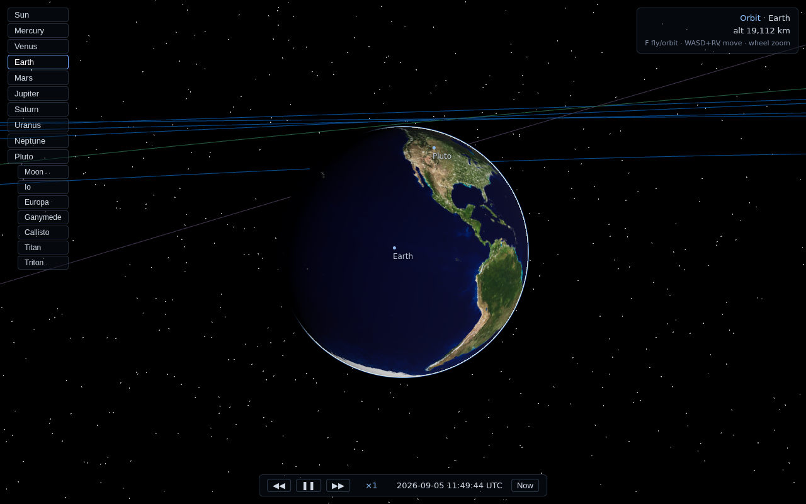
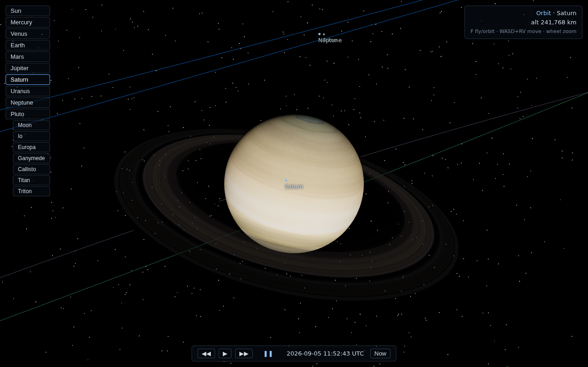
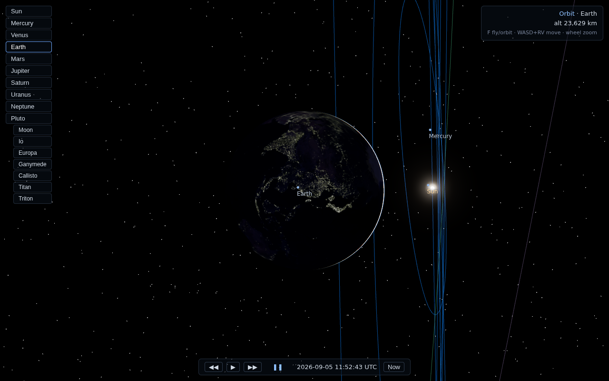
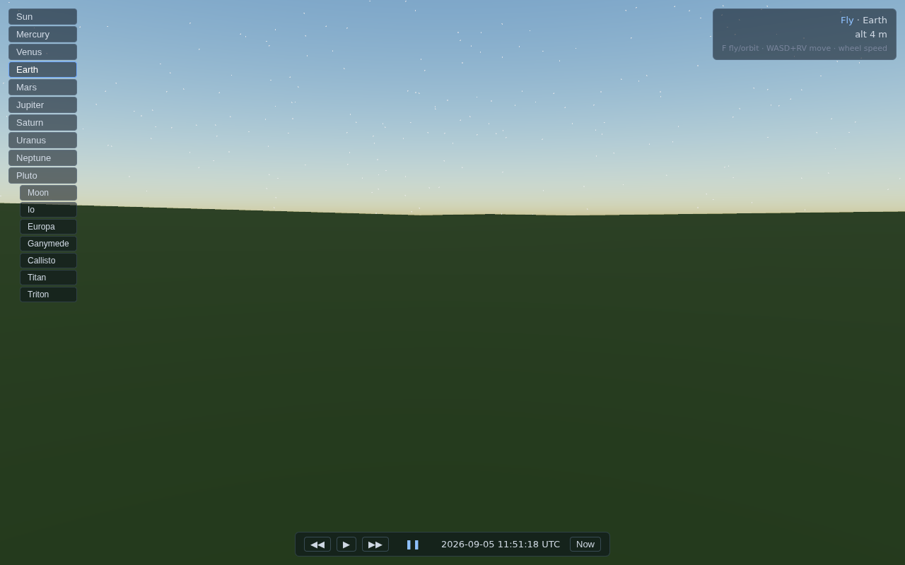

# Space Engine (web)

A SpaceEngine-style solar system simulator that runs in the browser:
the real Solar System with Keplerian orbits and seamless travel from
interplanetary space down to standing on procedurally detailed planetary
surfaces — no loading screens.

| | |
|---|---|
|  |  |
|  |  |

## Features

- **Real Solar System** — 8 planets, Pluto, the Moon, the Galilean moons,
  Titan and Triton, positioned by the JPL approximate planetary elements
  (J2000 + centennial rates) through an analytic Kepler solver. Time warp
  from real time to ±10,000,000×.
- **Seamless scale** — camera-relative rendering with f64 positions on the
  CPU (the render world is origin-rebased to the focused body), reversed
  logarithmic depth, dynamic near plane. Fly from the Sun to Pluto and land
  on the Moon with zero jitter.
- **Landable planets** — cube-sphere quadtree LOD terrain generated in a
  Web Worker pool: real albedo textures (NASA / Solar System Scope) plus a
  deterministic simplex-fBm heightfield with a meter-scale detail spectrum.
  The camera is clamped a few meters above the real ground.
- **Atmospheres** — raymarched single-scattering (Rayleigh + Mie) for
  Earth, Mars, Venus and Titan, written in TSL so it compiles to both
  WebGPU and WebGL2. Blue sky and sunsets from the surface, glowing limb
  from orbit.
- **Extras** — Saturn's rings, Earth's night-side city lights, HDR pipeline
  with ACES tone mapping and bloom, orbit lines, body labels and info panel.

## Running

```bash
npm install
npm run dev        # http://localhost:5173
npm test           # Kepler solver + terrain continuity unit tests
npm run build      # type-check + production build
```

WebGPU is used when available (Chrome/Edge, Safari 26+, Firefox 141+),
with an automatic WebGL2 fallback. Append `?webgl` to force the fallback.

## Controls

| Input | Action |
|---|---|
| click body / label | focus & fly to it |
| drag | orbit the focused body (orbit mode) / look around (fly mode) |
| wheel | zoom (orbit) / adjust speed (fly) |
| `F` | toggle orbit ↔ fly mode |
| `W A S D` + `R`/`V` | move in fly mode (speed scales with altitude) |
| `Q` / `E` | roll |
| `◀◀ ▶▶` | time warp, `Now` — jump to the current date |

## Architecture

```
src/
  core/        f64 math (Vec3d), constants, sim clock (Julian Date + warp)
  ephemeris/   Kepler solver, JPL element sets, body hierarchy
  data/        solar-system.json — orbital elements, radii, terrain and
               atmosphere parameters for every body
  render/      WebGPURenderer wrapper, HDR + ACES + bloom
  scene/       per-body views (impostor sphere ↔ terrain), origin rebasing,
               orbit lines, labels, rings, sun glow
  terrain/     cube-sphere quadtree, worker pool, shared heightfield
  atmosphere/  TSL single-scattering shader
  camera/      orbit/fly rig with f64 offsets and terrain clamp
  ui/          HUD: body list, time bar, status and info panels
```

Key invariants:

1. All world positions are f64 kilometers on the CPU (JS numbers). The GPU
   only ever sees coordinates relative to the focused body, so f32 stays
   precise where the camera is.
2. The terrain height function is **one global function per planet** — the
   octave cap does not depend on LOD level — so chunk borders match exactly
   across levels (verified by unit tests) and the camera clamp agrees with
   the rendered geometry.

## Verification

`scripts/*.mjs` are Playwright checks used during development (headless
Chromium, `?webgl` backend): fly-through Sun → Moon → Pluto, a Moon-surface
jitter test comparing consecutive frames byte-for-byte, LOD descent
screenshots, and a landing scenario (park at the subsolar point, pitch to
the horizon, fly forward against the terrain clamp).

## Honest limitations / roadmap

- Moon orbital phases are approximate (arbitrary epoch anomalies for most
  moons); planet positions are good to visualization accuracy (degrees).
- No eclipse/ring shadows, no clouds, no galaxy beyond a placeholder
  starfield; Mercury still lacks a texture.
- Terrain generation is CPU-worker based; a WebGPU compute path and KTX2
  texture compression are the next performance steps.

## Attribution

Textures: NASA (Blue Marble, Black Marble, LROC) — public domain; Solar
System Scope planet textures — CC BY 4.0. See
`public/textures/ATTRIBUTION.md`. Orbital elements: JPL "Approximate
Positions of the Planets".
